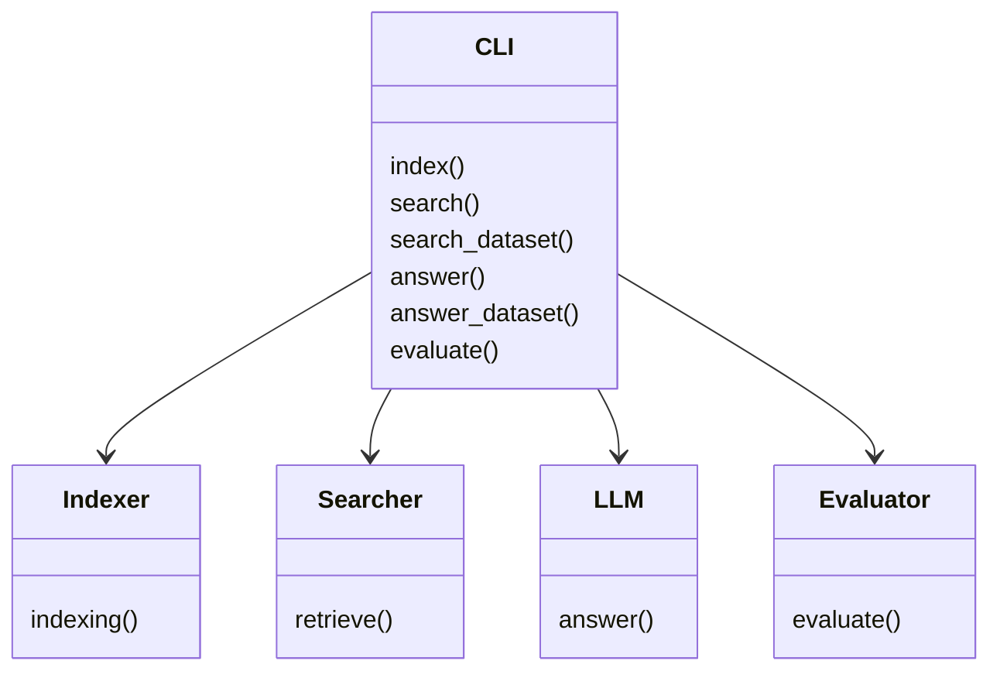

This project has been created as part of the 42 curriculum by cvillene.

# RAG against the machine

## Description
RAG against the machine aims to create a complete Retrieval-Augmented Generation system that can answer questions about a codebase.

An AI model is trained on a certain amount of data, so its generated answers are solely based on this amount of data. To ensure that a LLM (Large Language Model) has more up-to-date knowledge, we can either retrain it (process that takes a long time) or give it access to an external source of information. RAG allows to do the latter.  

For this project, we will use the LLM qwen3:0.6b and give it some context, from a codebase, relevant to the requested question so that it does not invent any answer (hallucinate).

## Instruction
### Installation:
```bash
make install
```
Install the required packages to run this project, and load the LLM.

### Execution:
```bash
make run CMD=<command> ARGS=<arguments>
```
or
```bash
uv run python3 -m src <command> <arguments>
```
A Command-Line Interface (CLI) is provided with Python Fire.

## System architecture
The RAG pipeline follows a few steps to generate a query-related answer about the codebase.

### 1. Ingestion:
The system ingests every document from the provided codebase. To do that, we must splits them into chunks of fixed size because the LLM can only process a limited amount of 'tokens' as context.

Then, these chunks are stored on disk into a tokenized vector representation, allowing to retrieve information from it.

### 2. Retrieval:
Before answer generation, we must retrieve the most relevant chunks for the given query. The BM25 algorithm is used to find the most relevant chunks and to rank them.

### 3. Generation:
Finally, the retrieved chunks are provided to the LLM as a context for the query. The AI will then extract the necessary information from it to generate a concise and relevant answer.

## Chunking strategy
### Text Chunking:
A method called 'Recursive character text splitter' is used to efficiently split text documents to several chunks. It consists of taking a list of characters (ex: ['\n\n', '\n', ' ', ' ']) and a maximum size of chunks (ex: 100). Then the text is recursively split using each of these characters until all the chunks have a size lesser or equal to the maximum size of chunks.

Another useful parameter can be used: 'chunk_overlap'. It is the number of characters overlapping each chunk, allowing to not lose context between the chunks.

### Python code Chunking:
Here, the Python scripts are split by logical constructs (e.g., functions, classes) to maintain logic in the chunks, and again, an overlapping parameter can be used to keep context.

## Retrieval method
### Best Matching 25:
BM25 is a ranking algorithm used to determine how relevant a document is to a given search query. It computes a relevance score between a query and a document using three main components: Term Frequency, Inverse Document Frequency and Document Length Normalization.
1. Term Frequency measures how often a query term appears in a document. A document containing a query term multiple times is more likely to be relevant. However, BM25 adds a saturation effect, to prevent overly long documents from being unfairly favored.
2. Inverse Document Frequency measures the importance of a term across the entire corpus (list of chunks). Rare terms are considered more informative than common ones like 'the', 'a', etc.
3. Document Length Normalization is the normalization of each score to prevent long documents from dominating the rankings.
The final scores calculation of each chunks is calculated by summing up the contributions of all query terms in a document.

## Performance analysis

To analyse the performances of the RAG system, the Recall@k metric is used:

$$Recall@k = \frac{TP@k}{TP@k + FN@k}$$

Where:
- TP@k (True Positives): retrieved relevant documents among the k first retrieved ones.
- FN@k (False Negatives): relevant documents not retrieved.

It measures the rate of relevant documents compared to the ground truth.

### Performances
1. Documentation questions:
- Recall@1: 60.0%
- Recall@3: 76.0%
- Recall@5: 85.0%
- Recall@10: 90.0%

2. Code questions:
- Recall@1: 30.0%
- Recall@3: 48.0%
- Recall@5: 54.0%
- Recall@10: 59.0%

## Design decisions
In this RAG system, 5 main classes are implemented:
- CLI: the main orchestrator, contains every CLI commands as function that will use the appropriate interface.
- Indexer: executes entirely the ingestion pipelines (loading, chunking and indexing).
- Searcher: uses BM25 to retrieve relevant chunks from a specific query.
- Evaluator: applies the Recall@k metrics on the search results.


## Challenges faced:
The main difficulties were to understand the new key concepts and which algorithm to choose for this implementation of a RAG system.

## Example usage:
### Indexing:
```bash
make run CMD=index ARGS='--directory_path codebase/ --max_chunk_size 2000 --text_code_overlap 50 --python_code_overlap 0.15'

All arguments are optional:
- directory_path: string
- max_chunk_size: integer (>0 and <=2000)
- text_chunk_overlap: integer (number of chars) or float (percentage of max_chunk_size)
- code_chunk_overlap: integer (number of chars) or float (percentage of max_chunk_size)
```

### Searching:
For a unique query,
```bash
make run CMD=search ARGS='"What is vLLM?" --k 10'

Arguments:
- --query: string (mandatory)
- --k: integer (optional)
```
For a whole dataset:
```bash
make run CMD=search_dataset ARGS='--dataset_path data/dataset/UnansweredQuestions/dataset_docs_public.json --k 10 --save_directory data/output/search_results/'

Arguments:
- --dataset_path: string (mandatory)
- --k: integer (optional)
- --save_directory: string (mandatory)
```

### Answering
For a unique query,
```bash
make run CMD=answer ARGS='"What is vLLM?" --k 10'

Arguments:
- --query: string (mandatory)
- --k: integer (optional)
```
For a whole dataset:
```bash
make run CMD=answer_dataset ARGS='--student_search_results_path data/output/search_results/dataset_docs_public.json --save_directory data/output/search_results_and_answer/'

Arguments:
- --student_search_results_path: string (mandatory)
- --save_directory: string (mandatory)
```

## Resources
- https://arxiv.org/pdf/2407.01219
- https://www.geeksforgeeks.org/nlp/what-is-bm25-best-matching-25-algorithm/
- https://pypi.org/project/BM25/
- https://realpython.com/ollama-python/
- https://towardsdatascience.com/how-to-evaluate-retrieval-quality-in-rag-pipelines-precisionk-recallk-and-f1k/
- Some other resources on langchain and python-fire
#### AI was used to
- understand the subject.
- generate a good system prompt for the LLM.
- understand the use of hyperparameters of the function `Client().chat()` of the ollama module.
- fix some errors in the `Evaluator().evaluate()` function.
- fix mypy errors.
- fix orthographic errors in docstrings and README.
